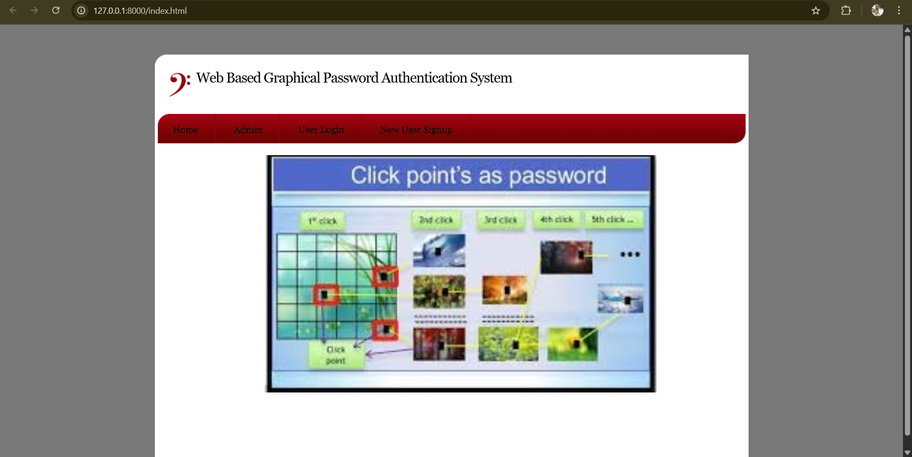
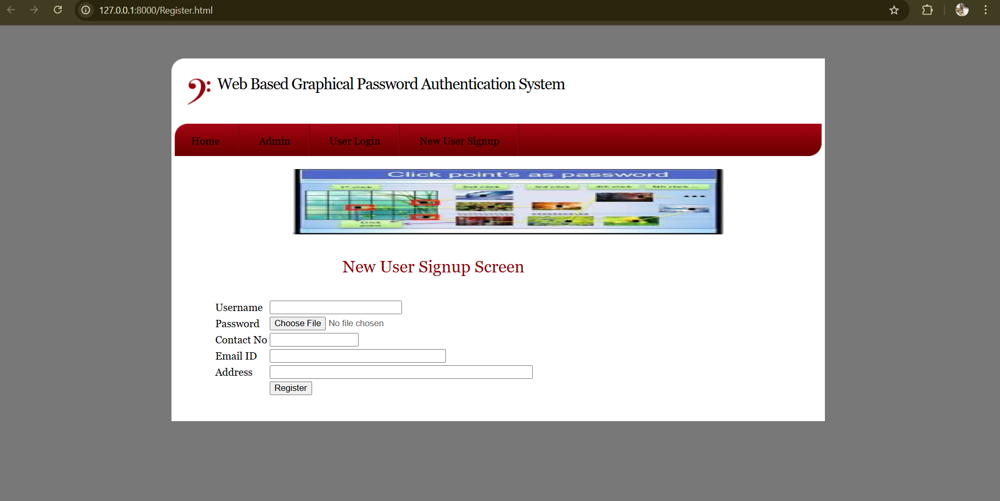
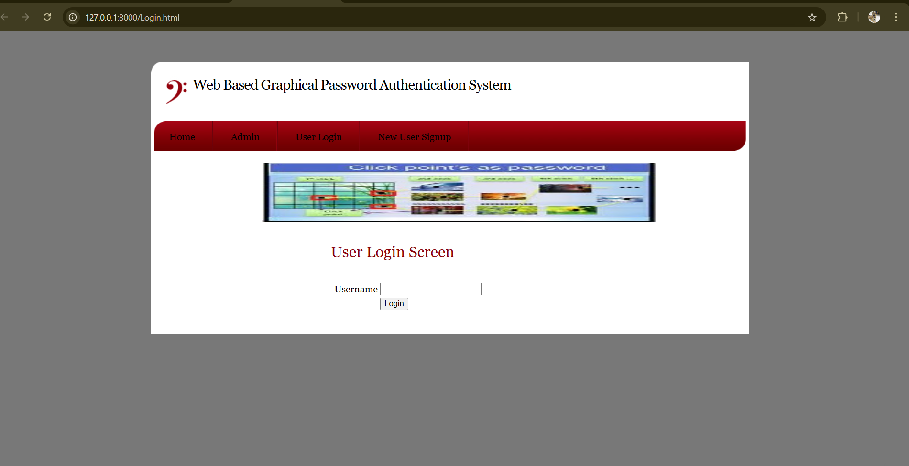

# Web-Based Graphical Password Authentication System 🔐

A secure and intuitive graphical authentication system that replaces traditional text-based login methods, enhancing resistance to brute-force attacks.

## 🚀 Features
- Click-based graphical password system
- Increased security against brute-force and dictionary attacks
- Clean UI with intuitive user interaction

## 🛠️ Technologies Used
- HTML, CSS, JavaScript
- Python (Django)
- SQLite or MySQL

## 📂 Project Structure

## 🖼️  Screenshots

### 🔐 Homepage

### 📝 Register

### 🔐 Login

